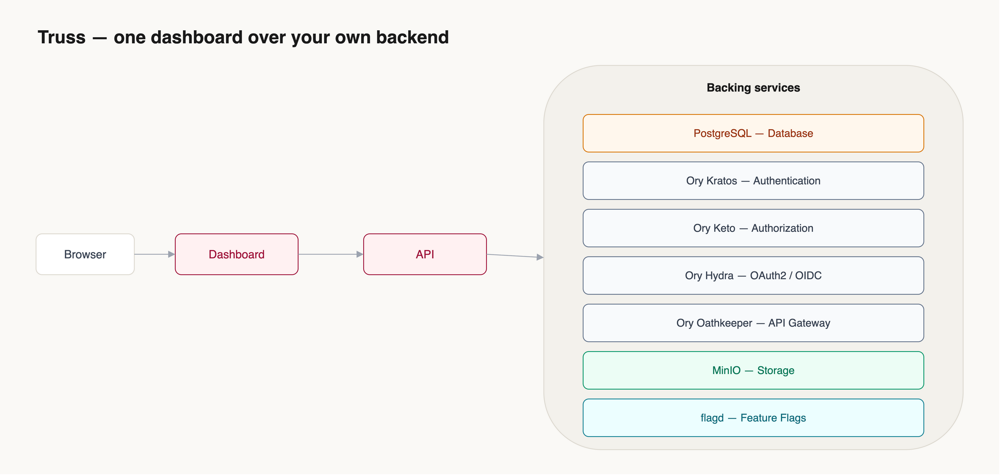

# Truss

**Open-source, self-hostable Backend-as-a-Service console.** One dashboard over Postgres,
authentication, fine-grained authorization, and S3-compatible storage — so you get a
Supabase/Appwrite-style backend you fully own.

[](LICENSE)

> **Open core.** This repo is the single-instance app you self-host. The managed,
> multi-tenant **Truss Cloud** (provisioning, metering, billing) is a separate hosted service.

<p align="center">
  
</p>

## What's inside

- **Database** — Postgres SQL workbench (Monaco editor, **read-only by default**), schema browser, ERD, pgvector, full-text search, security/perf advisors.
- **Authentication** — email/password, magic links, social login, MFA (Ory Kratos).
- **Authorization** — fine-grained, relation-based permissions / RBAC (Ory Keto).
- **OAuth2 / OIDC** — be your own identity provider (Ory Hydra).
- **Storage** — S3-compatible buckets, presigned up/downloads (MinIO).
- **Cache / KV** — Redis-compatible in-memory cache, sessions, rate-limit counters (Valkey).
- **Plus** — realtime subscriptions, webhooks, database branching, backups/PITR, a client API surface, feature flags.
- **MCP server** — operate your instance from an AI agent (Claude Code / Desktop, Cursor) over the Model Context Protocol. See [`apps/mcp`](apps/mcp/).

## Quickstart (self-host)

The whole stack — Postgres, Kratos (auth), Keto (authz), MinIO (storage), Valkey (cache),
flagd, the API, and the dashboard — comes up from one command. **Three supported ways to run
Truss**, all off the same images (latest release: **v0.3.0**):

**1. Docker Compose** — single box, simplest. See [`selfhosted/README.md`](selfhosted/README.md):

```bash
cp .env.selfhosted.example .env.selfhosted   # fill in generated secrets
docker compose -f docker-compose.selfhosted.yml --env-file .env.selfhosted up -d
# optional 4-signal observability (Grafana/Prometheus/Loki/Tempo):
#   -f docker-compose.selfhosted.yml -f docker-compose.observability.yml
```

**2. Kubernetes — umbrella Helm chart**, no operator required. Secrets auto-generate on first
install (persisted + reused across upgrades), so it really is one command:

```bash
helm install truss oci://ghcr.io/binarysquadd/charts/truss --version 0.3.0 \
  -n truss --create-namespace
# from source instead: helm install truss ./charts/truss -n truss --create-namespace
kubectl -n truss port-forward svc/truss-dashboard 3000:80   # → http://localhost:3000
```

Bring your own secrets with `--set secrets.encryptionKey=…` (any left blank are generated).
Flip on the bundled observability stack with `--set observability.backends.enabled=true`.

**3. Kubernetes — the Truss operator**, declarative and fleet-friendly (a `TrussInstance` CRD
reconciles the app tier, with drift-healing, status conditions, and optional ServiceMonitor /
burn-rate SLO alerts). Bring your own Postgres (a Secret with a `database-url` key):

```bash
kubectl apply -f https://github.com/binarysquadd/truss/releases/download/v0.3.0/install.yaml
kubectl apply -f - <<'EOF'
apiVersion: apps.truss.binarysquad.org/v1alpha1
kind: TrussInstance
metadata: { name: truss, namespace: truss }
spec:
  version: "0.3.0"
  dependencies:
    postgres: { mode: byo, existingSecret: truss-db }
EOF
```

**First login:** on first boot Truss seeds a default admin (`admin@truss.local`) so you
can sign in right away. The password is printed once to the API logs:
`kubectl -n truss logs deploy/truss-api | grep "Default admin"` (Compose:
`docker compose logs truss-api | grep "Default admin"`). Change it immediately under
**Settings → Account**. Set `TRUSS_BOOTSTRAP_ADMIN_PASSWORD` for known creds, or
`TRUSS_BOOTSTRAP_ADMIN=false` to disable seeding and register the first user yourself.

Images are published (and cosign-signed) at `ghcr.io/binarysquadd/truss-{api,dashboard,mcp,operator}`
(override `images.*` to pin/replace). For production, set `publicUrl` + `corsAllowedOrigins` and
front it with TLS. Full deployment guide: [docs](apps/docs) → **Getting Started → Ways to run Truss**.

## Development

```bash
npm install
cp .env.example .env        # DATABASE_URL, KRATOS_*, KETO_*, MINIO_* (see the file)
make dev                    # api :8787 + dashboard :5173 + docs
```

See [CONTRIBUTING.md](CONTRIBUTING.md) for the monorepo layout and conventions.

## Hardening (read before exposing to the internet)

- **`CORS_ALLOWED_ORIGINS`** — must be set to your dashboard origin(s). CORS fails closed;
  if unset, the browser app can't reach the API (this is intentional).
- **`ENCRYPTION_KEY`** — a random 32+ char string used to encrypt saved connection
  passwords. **If you lose it, those are unrecoverable.** Set it once and back it up.
- **`TRUSS_ADMIN_IDENTITY_IDS`** — admin-only features (DB roles, migrations, backups,
  authorization rules) are gated. To grant yourself admin: register your account, find your
  Kratos identity ID (`GET /.ory/kratos/sessions/whoami`, or the Authentication panel), set
  `TRUSS_ADMIN_IDENTITY_IDS=<your-id>` (comma-separated for more), and restart the API.
- Put the API behind TLS, run Postgres with backups (PITR), and don't run with dev defaults.

## Architecture & limits

Single-instance edition: **one organization / environment / project** per deployment.
Need many tenants, metering, or billing? That's Truss Cloud — or run multiple instances.

- Frontend: React 19 + Vite + Tailwind v4 + Monaco. Backend: Node + Express 5 + `pg`.
- Cloud-only UI (billing/org admin) ships disabled behind `VITE_IS_PLATFORM` (default off).

## Docs · Contributing · Security · License

- Docs: `apps/docs` (Astro Starlight)
- [Contributing](CONTRIBUTING.md) · [Security policy](SECURITY.md) · [AGPL-3.0](LICENSE)
